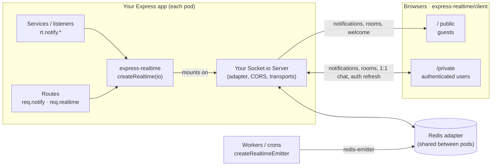

# express-realtime

[](https://www.npmjs.com/package/express-realtime)
[](https://www.npmjs.com/package/express-realtime)
[](https://bundlephobia.com/package/express-realtime)
[](https://github.com/ElJijuna/express-realtime/actions/workflows/release.yml)
[](https://github.com/ElJijuna/express-realtime/actions/workflows/ci.yml)
[](https://github.com/ElJijuna/express-realtime/blob/main/package.json)
[](https://nodejs.org)
[](https://www.npmjs.com/package/express-realtime)
[](https://github.com/semantic-release/semantic-release)
[](https://www.npmjs.com/package/express-realtime#provenance)


A friendly layer over **your core's own Socket.io server** for Express:

- notifications shaped as `{ title, message, icon, date, data }`
- public (no auth) and private (auth) channels
- open or authorized rooms
- 1:1 chat
- welcome messages
- rate limiting, token revalidation and graceful shutdown

The library **does not create or hide Socket.io**. It mounts on the `Server` instance your core already has. The core keeps control of the adapter, transports, CORS and its own middlewares, and the native API stays available as `rt.io`.

## Architecture



## Installation

```bash
npm install express-realtime socket.io
# frontend
npm install socket.io-client
# workers without a Socket.io server (optional)
npm install @socket.io/redis-emitter
```

## Quick start

```ts
import { createServer } from 'node:http';
import express from 'express';
import { Server } from 'socket.io';
import { createRealtime } from 'express-realtime';

const app = express();
const httpServer = createServer(app);
const io = new Server(httpServer, { /* core config */ });

const rt = createRealtime<User>(io, {
  authenticate: (handshake) => verifyJwt(handshake.auth.token), // User | null
  getUserId: (user) => user.id,
  getUserName: (user) => user.name,
  getUserRooms: (user) => user.roles.map((role) => `role:${role}`),
});

app.use(rt.middleware()); // adds req.notify and req.realtime

app.post('/orders', auth, (req, res) => {
  req.notify({ user: order.sellerId }, {
    title: 'New order', message: `#${order.id}`, icon: 'cart', data: { orderId: order.id },
  });
  res.status(201).json(order);
});

// Outside a request (services, jobs, listeners)
rt.notify.role('admin', { title: 'Deploy', message: 'v2.3 released' });
```

### Why `req.notify` and not `res.notify`?

`res` is the response to **this** HTTP client. A notification goes to **other** users (or to other tabs of the same user), so it is not part of the response. `req` carries the request context (`req.user`), which is why `req.notify` fills `from` with the authenticated user.

| From                     | Use                                         |
| ------------------------ | ------------------------------------------- |
| a route                  | `req.notify(target, payload)`               |
| a route, full API        | `req.realtime.notify / rooms / chat`        |
| core services            | `rt.notify.*`                               |
| workers or crons         | `createRealtimeEmitter(new Emitter(redis))` |

## Notifications

Pass the minimum, `{ title, message, icon?, date?, data? }`, and the server fills in the rest:

```ts
interface Notification<T> {
  id: string;        // auto uuid: the client deduplicates across tabs and reconnections
  type: string;      // 'generic' by default; the library uses 'welcome' and 'room.join'
  level: 'info' | 'success' | 'warning' | 'error'; // 'info' by default
  title: string;
  message: string;
  icon?: string;
  date: string;      // ISO 8601; accepts a Date, number or string when sending
  link?: string;
  from?: { id: string; name?: string };
  data?: T;
}
```

Targets can be combined in a single `send`, and each socket receives the notification once:

```ts
rt.notify.user('42', payload);                 // every tab of the user
rt.notify.user(['1', '2'], payload);
rt.notify.role('admin', payload);              // role:admin (via getUserRooms)
rt.notify.room('lobby', payload);              // public and private members
rt.notify.broadcastPrivate(payload);           // every authenticated socket
rt.notify.broadcastPublic(payload);            // the whole public namespace
rt.notify.send({ user: '1', room: 'team:red' }, payload);
rt.notify.except('1').room('lobby', payload);  // skip the sender
```

A `RealtimeValidationError` is thrown when `title` or `message` is missing, or when either exceeds `limits.titleMaxLength` (200) or `limits.messageMaxLength` (2000).

## Namespaces and auth

| Namespace     | Auth                          | Automatic rooms                                  |
| ------------- | ----------------------------- | ------------------------------------------------ |
| `/` (public)  | optional (never rejects)      | —                                                |
| `/private`    | `authenticate` required       | `user:{id}`, `authenticated`, `getUserRooms()`   |

Both names are configurable with `publicNamespace` (or `false` to disable it) and `privateNamespace`. The token goes in `handshake.auth.token`, **never in the query string**, because query strings end up in logs.

### Expiry and revocation

```ts
createRealtime(io, {
  getTokenExpiry: (user, handshake) => decodeJwt(handshake.auth.token).exp * 1000,
  expiryWarningMs: 60_000,
});
```

1. The server emits `auth:expiring` before the token expires.
2. The client answers with `auth:refresh` and a new token. The same `authenticate` validates it, and it must belong to the same user.
3. Without a refresh in time, the server emits `auth:expired` and disconnects.

`rt.disconnectUser(id, reason)` emits `session:revoked` and closes every tab of the user on every pod (logout or ban).

## Rooms

```ts
rt.rooms.define('lobby', { access: 'public' });   // guests included
rt.rooms.define('team:*', {                        // patterns with *
  access: 'private',
  canJoin: (user, room) => user.teams.includes(room.split(':')[1]),
});
```

- Clients use `room:join` and `room:leave` with an ack `{ ok, data | error }`.
- Undeclared rooms fall back to `canJoinRoom`; without it they are denied.
- Clients can never join `user:*`, `role:*`, `dm:*` or `authenticated`.
- Server-side: `rt.rooms.join(userId, room)`, `leave`, `emit(room, event, ...args)` and `members(room)`.

## Welcome messages

Sent as a `Notification` with `type: 'welcome'`, **only to the socket that connects or joins**:

```ts
createRealtime(io, {
  welcome: {
    public: ({ user }) => (user ? null : { title: 'Hi', message: 'Welcome' }), // guests only
    private: ({ user }) => ({ title: `Hi ${user.name}`, message: 'You have 3 tasks' }),
  },
});

rt.rooms.define('lobby', {
  access: 'public',
  welcome: ({ room }) => ({ title: `Welcome to ${room}`, message: 'Be nice' }),
  announce: ({ user }) => ({ title: 'New member', message: `${user?.name ?? 'A guest'} joined` }), // to the others
});
```

- A function that returns `null` sends nothing. If it throws, `onError` is called and the connection stays open.
- The typed client opens both connections, so a logged-in user also gets the public welcome unless the function returns `null` when `user` is set, as in the example above.
- Runtime changes: `rt.welcome.set('public', {...})` and `rt.rooms.update('lobby', { welcome })`. They accept static objects only and are propagated to every pod with `serverSideEmit`.
- If the core's adapter supports connection state recovery, the welcome is not repeated on recovered reconnections.

## 1:1 chat

- The client sends `chat:send { to, text, data? }`. `from` always comes from the authenticated socket.
- The message reaches every tab of the recipient and the sender's other tabs. The sending socket gets it in the ack.
- `conversationId` is `dm:{a}:{b}`, stable regardless of who writes first.
- `canChat(from, toId)` handles blocking. `onChatMessage(message, ctx)` is awaited before emitting, so you can persist the message; if it throws, the client gets `chat_rejected`.
- The library keeps no history.
- `rt.chat.send(from, to, { text })` sends server-side (bots, REST).

## Declarative handlers

```ts
rt.on('private', 'order:track', async ({ data, user }) => getOrder(data, user), {
  validate: orderIdSchema.parse,        // zod or any function that throws
  rateLimit: { points: 5, perMs: 1000 },
});
```

The returned value is sent as `{ ok: true, data }`. If the handler throws `RealtimeError('code')`, the client receives that code. Any other error goes to `onError` and the client receives `internal_error`, so internal details never leak.

## Rate limiting

A token bucket per socket and per event. It lives in memory and works the same with several pods, because each socket lives on a single pod.

```ts
createRealtime(io, {
  rateLimit: {
    default: { points: 20, perMs: 1000 },          // library events and rt.on handlers
    events: { 'chat:send': { points: 5, perMs: 1000 }, 'core:event': { points: 1, perMs: 1000 } },
  },
});
```

When a socket goes over the limit, the ack returns `rate_limited`, the client receives `rate:limited { event, retryAfterMs }` and the `metrics.rateLimited` hook is called.

## Observability

```ts
createRealtime(io, {
  logger: pino(),                        // { debug, info, warn, error }
  onError: (error, ctx) => sentry.captureException(error, { extra: ctx }),
  metrics: {
    connection: ({ scope }) => gauge.inc({ scope }),
    disconnection: ({ scope }) => gauge.dec({ scope }),
    event: ({ event, ok, durationMs }) => histogram.observe({ event, ok }, durationMs),
    notification: ({ type }) => counter.inc({ type }),
    rateLimited: ({ event }) => limited.inc({ event }),
  },
  onConnect: (socket) => {},
  onDisconnect: (socket, reason) => {},
});
```

## Graceful shutdown

```ts
process.on('SIGTERM', async () => {
  await rt.close({ timeoutMs: 5000, reconnectInMs: 1000 }); // leaves io open unless closeIo: true
  httpServer.close();
});
```

On close:

1. New connections are rejected (`server_shutting_down`).
2. `server:shutdown` is emitted to local sockets.
3. The library waits for them to leave, then disconnects the rest.

The typed client reconnects on its own, and the load balancer sends it to another pod.

## Multiple instances (core requirements)

The library works with any adapter. What the core has to configure:

- **A shared adapter**: `@socket.io/redis-adapter` or `@socket.io/redis-streams-adapter` in `io.adapter(...)`. Without one, notifications, `disconnectUser`, `rooms.join` and `members` only reach the local pod.
- **Sticky sessions** on the load balancer, or `transports: ['websocket']` on both server and client. Without either, long-polling fails with `Session ID unknown`.
- **Connection state recovery** (optional): with `redis-streams-adapter` and `connectionStateRecovery` in `new Server(...)`, short reconnections recover missed events and do not repeat the welcome. The classic `redis-adapter` does not support it.
- `rt.isOnline()` and `rt.rooms.members()` query every pod: do not call them on every request.

### Workers

```ts
import { Emitter } from '@socket.io/redis-emitter';
import { createRealtimeEmitter } from 'express-realtime';

const realtime = createRealtimeEmitter(new Emitter(redisClient));
realtime.notify.user('42', { title: 'Export ready', message: 'Download it now' });
realtime.disconnectUser('42', 'password changed');
```

## Client

```ts
import { createRealtimeClient } from 'express-realtime/client';

const rt = createRealtimeClient('https://api.example.com', {
  getToken: () => auth.token,         // called on every (re)connection
  refreshToken: () => auth.refresh(), // on auth:expiring, auth:expired or a rejected handshake
  onSessionRevoked: () => logout(),
});

rt.onNotification((n) => toast(n.title, n.message)); // deduplicated by id
await rt.rooms.join('lobby');
const message = await rt.chat.send('42', { text: 'hi' });
rt.chat.onMessage((m) => {});
const result = await rt.call('order:track', 7); // throws RealtimeClientError(code)
```

`refreshToken` must update what `getToken` returns and return the new token.

### Typing indicator

```ts
input.addEventListener('input', () => rt.chat.typing(to, true)); // on every change
rt.chat.onTyping(({ from, typing }) => showTyping(from, typing));  // only on changes
```

The indicator cannot get stuck, even though typing events are volatile and one can be lost:

- **Sender:** it sends `typing: true` at most once every `throttleMs`, which also works as a keep-alive. It sends `typing: false` on its own after `idleMs` without calls. `chat.send` needs no `false`, because the message itself clears the indicator.
- **Receiver:** the indicator is cleared when that user's message arrives (before `onMessage` listeners run), when no news came for `expireMs` because a `false` was lost, and when the private connection drops.

```ts
createRealtimeClient(url, { typing: { throttleMs: 2000, idleMs: 3000, expireMs: 6000 } }); // defaults
```

### Custom server events

```ts
// Whatever the server sends with rt.rooms.emit() or the core's own io
const off = rt.on<[string, number]>('score', (team, points) => {});
rt.on('news', onNews, { scope: 'public' }); // one connection only
off();

const lobby = await rt.rooms.join('lobby');
lobby.on('game:start', startGame); // listens on the connection that joined the room
await lobby.leave();               // leaves and removes the room's listeners
```

- Listeners survive reconnections, `logout()` and `login()`.
- `rt.on` listens on both connections by default, so an event the server emits on both namespaces arrives twice. Pass `scope` to avoid that.
- Socket.io does not tag events with the room they were sent to. `lobby.on('game:start')` also receives a `game:start` sent to another room this client is in, so use distinct event names or put the room in the payload.
- Connection events (`connect`, `disconnect`, ...) throw an error: use `onStatusChange()` instead.

### Typed events

Describe your own handlers and events once, and `call()`, `on()` and `room.on()` check names, data and results:

```ts
import { createRealtimeClient, type RealtimeEvents } from 'express-realtime/client';

interface AppEvents extends RealtimeEvents {
  calls: {
    'order:track': { data: number; result: { status: string } };
    'dice:roll': { result: number };             // no data
  };
  events: {
    score: [team: string, points: number];       // listener arguments
  };
}

const rt = createRealtimeClient<AppEvents>(url, options);

const order = await rt.call('order:track', 7);  // { status: string }
rt.on('score', (team, points) => {});           // string, number
rt.on('rate:limited', ({ retryAfterMs }) => {}); // library events are already typed
rt.call('order:track', 'x');                     // ✗ type error
rt.on('scroe', () => {});                        // ✗ type error
```

- `calls` and `events` are independent: a part you leave out stays untyped.
- Without a type argument, `call<Result>(event, data)` and `on<Args>(event, listener)` accept any name, as before.

### Login and logout

A single client follows the user across sign-in and sign-out, so you never have to create a new one:

```ts
const rt = createRealtimeClient(url); // guest: public connection only

await rt.login(() => auth.token); // opens /private; rejects with RealtimeClientError('unauthorized')
rt.loggedIn;                      // true
rt.logout();                      // closes /private and keeps the public connection
```

- `login()` resolves once `/private` is connected. The `getToken` you pass replaces the one given in the options.
- `logout()` forgets the rooms joined through `/private`. Listeners such as `chat.onMessage` are kept for the next `login()`.
- `rt.private` is `null` while logged out. Chat and `call(..., { scope: 'private' })` reject with `unauthorized`.
- After `session:revoked`, or when the server refuses the token, `loggedIn` goes back to `false` and `login()` can be called again.

### Connection status

```ts
rt.status; // 'connecting' | 'connected' | 'reconnecting' | 'offline'
rt.onStatusChange((status) => banner.show(status !== 'connected'));
rt.onReconnect(({ recovered }) => {
  if (!recovered) refetchUnread(); // events sent while disconnected were lost
});
```

- `connected` means every connection still in use is up. `reconnecting` means one dropped and the client is getting it back (including after a graceful shutdown).
- `offline` means `close()` was called or no connection will come back on its own: a revoked session, a rejected handshake that `refreshToken` could not fix, or exhausted reconnection attempts.
- A connection that is given up stops counting while the other is still in use. For example, a revoked `/private` with the public connection up still reports `connected`, and `onSessionRevoked` tells you about it.
- `recovered` is true only when every dropped connection got its server session back through connection state recovery, so the events sent meanwhile were replayed. The library keeps no history, so when it is false, refetch what the UI shows.

## Events

| Server → client | Client → server (with ack) |
| --------------- | -------------------------- |
| `notification`, `chat:message`, `chat:typing` | `room:join`, `room:leave` |
| `auth:expiring`, `auth:expired`, `session:revoked` | `chat:send`, `chat:typing` (no ack) |
| `rate:limited`, `server:shutdown` | `auth:refresh` |

`ServerToClientEvents` and `ClientToServerEvents` are exported so you can type your own `io` or `socket.io-client`.

## Live demo

```bash
npm run demo   # http://localhost:3000 (PORT to change it)
```

Open it in two or more tabs and log in as different users (Ana is an admin in team red, Bob is in team red, Eve is in team blue). The page shows every feature: connection status and recovery, login/logout and token refresh, notifications, rooms with custom events, 1:1 chat with typing, handlers and rate limiting, and session revocation. The server is [examples/demo/server.ts](examples/demo/server.ts). The page, [examples/demo/public/app.ts](examples/demo/public/app.ts), is bundled with esbuild on every request, so edit it and reload.

## Development

```bash
npm test                                     # unit + integration
REDIS_URL=redis://localhost:6379 npm test    # + cluster tests
npm run lint && npm run format:check && npm run typecheck
npm run docs                                 # TypeDoc into docs/
npm run example                              # example server; then npm run example:client
npm run demo                                 # live demo in the browser
```

Tooling (ESLint, Biome, TypeScript, Vitest and TypeDoc) extends [`super-configs`](https://www.npmjs.com/package/super-configs).
